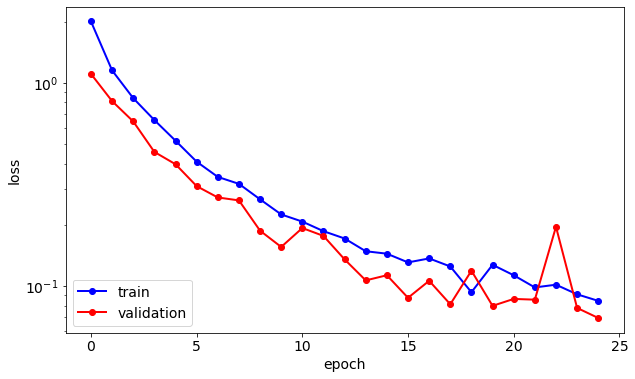
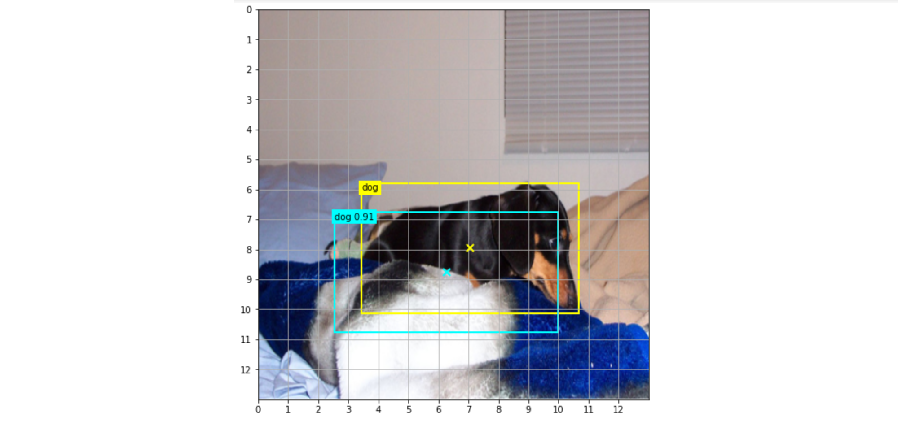

[](https://github.com/PyCQA/pylint)
[](https://github.com/psf/black)

# tensorflow implementation of YOLO v2
This repository contains an implementation of YOLOv2 and is based on [Vivek Maskara's blog](https://www.maskaravivek.com/post/yolov2/), which in turn follow [Yumi's blog](https://fairyonice.github.io/Part_4_Object_Detection_with_Yolo_using_VOC_2012_data_loss.html). The backbone network is [Joseph Redmon's Darknet](https://pjreddie.com/darknet/), but in this repository it is of course implemented in tensorflow.

### Prerequisites
The following Python modules are required to run the code
* [tensorflow 2](https://www.tensorflow.org/)
* [OpenCV for Python](https://pypi.org/project/opencv-python/)
* [COCO API for Python](https://github.com/cocodataset/cocoapi)

### Loss function evaluation
Mathematical details on the loss function can be found in [this notebook](./LossFunction.ipynb). One major difference is the implementation of the computation of the term in the confidence loss
which computes the IoU of a predicted bounding box $\mathcal{B} (x^p_{i,j},y^p_{i,j},w^p_{i,j},h^p_{i,j})$ with all ground truth bounding boxes and checks that the maximum IoU does not exceed 0.6. Instead of using the trick in [Yumi's blog](https://fairyonice.github.io/Part_4_Object_Detection_with_Yolo_using_VOC_2012_data_loss.html), namely passing a tensor with all true bounding boxes through the network, this tensor is constructed when evaluating the loss function. For this, the indices of all true bounding boxes $\mathcal{B}(x_{i',j'},y_{i',j'},w_{i',j'},h_{i',j'})$ are extracted from the ground truth tensor, which has shape $M\times S \times S \times B\times(5+C)$, and used to construct a tensor of shape $M\times M\times N_{\text{buffer}}$ with `tf.gather_nd()` and `tf.scatter_nd()` calls. Here $M=8$ is the batchsize (I couldn't train with larger batches due to memory limitations) $S=13$ is the number of gridboxes in each direction, $B=5$ is the number of anchor boxes and $C$ is the number of classes ($C=80$ for COCO and $C=20$ for PascalVOC). $N_{\text{buffer}}$ is the size of the true anchor box buffer, and ideally this should be larger than the total number of true anchor boxes.

### Weights
When training with the [training notebook](src/TrainModel.ipynb), darknet is initialised with Joseph Redmon's [weights for Darknet](https://pjreddie.com/darknet/yolo/). These weights can be can be downloaded with
```
!wget https://pjreddie.com/media/files/yolov2.weights
```

### Anchor box generation
The anchor boxes are generated with k-means clustering, as described in [the YOLO9000 paper]((https://arxiv.org/abs/1612.08242)). This is done for both the PascalVOC and for the COCO datasets in [this notebook](src/GenerateAnchorBoxes.ipynb). The results are stored in the json files `anchor_boxes_coco.json` and `anchor_boxes_pascalvoc.json`.

## Code structure
All code is contained in the `src` subdirectory. The following notebooks implement the high-level algorithms:
* [GenerateAnchorBoxes.ipynb](src/GenerateAnchorBoxes.ipynb): Generate anchor boxes for YOLOv2 model, both for the COCO and the PascalVOC dataset.
* [ReadImages.ipynb](src/ReadImages.ipynb): Read some images from the COCO and PascalVOX datasets and visualise them with ground-truth annotations
* [TrainModel.ipynb](src/TrainModel.ipynb): Train darknet with the YOLOv2 loss function and save the weights to a specified directory.
* [EvaluateModel.ipynb](src/EvaluateModel.ipynb): Generate some predictions with a trained model and visualise them together with the ground-truth bounding boxes.

The following python files implement the key classes and functions:
* [anchor_boxes.py](src/anchor_boxes.py): Auxilliary functions for dealing with anchor boxes. Implements k-means clustering with the IoU metric.
* [darknet.py](src/darknet.py): The Darknet model with weights initialised from a specified datafile
* [data_generator.py](src/data_generator.py): Class for generating training data in the tensorflow dataset format. The datagenerator classes operate on image readers.
* [image_reader.py](src/image_reader.py): Classes for reading annotated images from the COCO and PascalVOC datasets using the OpenCV module.
* [loss_function.py](src/loss_function.py): YOLOv2 loss function, see [here](LossFunction.ipynb) for a detailed mathematical discussion.
* [post_processing.py](src/post_processing.py): Functions for post-processing predictions. Currently this implements standard non-max suppression (NMS) and [soft-NMS](https://arxiv.org/abs/1704.04503).

## Datasets
The code can process images from the [COCO](https://cocodataset.org/#home) and [PascalVOC](https://cocodataset.org/#home) datasets. I used the 2017 train/val data from COCO and the VOC2012 data. The relevant classes `COCOImageReader` and `PascalVOCImageReader` are implemented in `image_reader.py`

## Results
Loss history from training on the entire `trainval` PascalVOC 2012 dataset, validating on the `val` subset.

The following image shows an example detecting. Predicted bounding boxes are shown in cyan, the ground truth is shown in yellow.



## References
* Redmon, J., Divvala, S., Girshick, R. and Farhadi, A., 2016. *You only look once: Unified, real-time object detection.* In Proceedings of the IEEE conference on computer vision and pattern recognition (pp. 779-788). [arxiv:1506.02640](https://arxiv.org/abs/1506.02640)
* Redmon, J. and Farhadi, A., 2017. *YOLO9000: better, faster, stronger.* In Proceedings of the IEEE conference on computer vision and pattern recognition (pp. 7263-7271).[arxiv:1612.08242](https://arxiv.org/abs/1612.08242)
* Bodla, N., Singh, B., Chellappa, R., Davis, L. S. *Soft-NMS -- Improving Object Detection With One Line of Code* [arxiv:1704.04503](https://arxiv.org/abs/1704.04503)